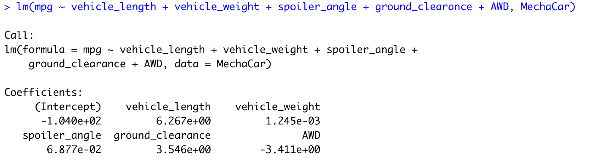
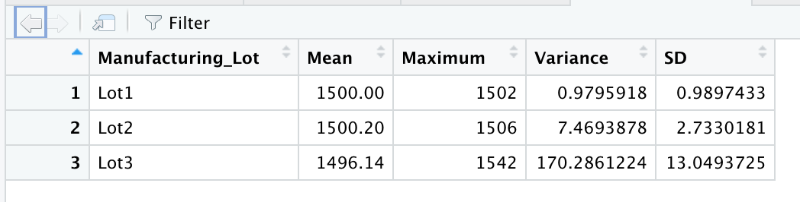
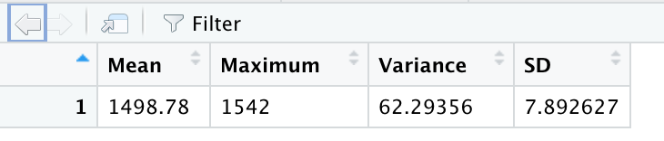
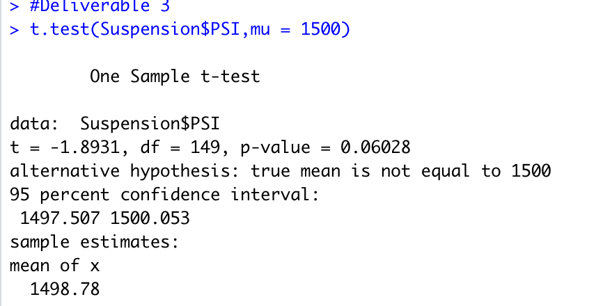
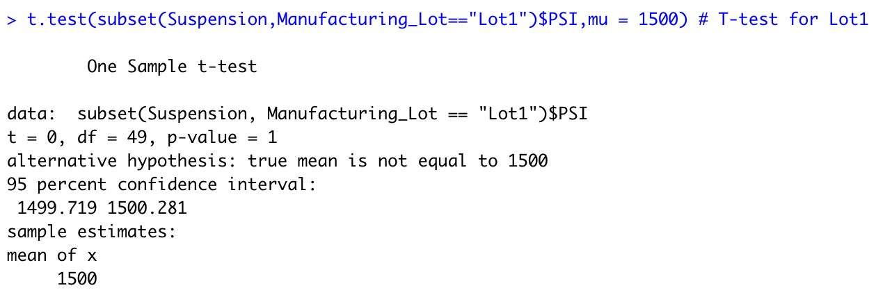
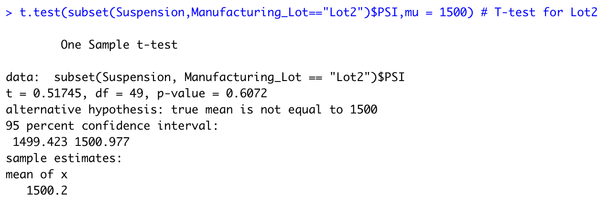
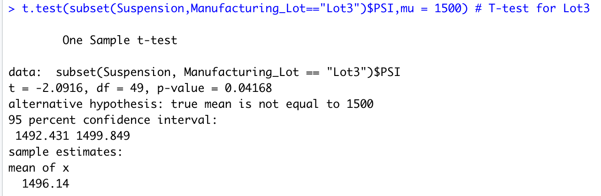

# MechaCar_Statistical_Analysis

## Linear Regression to Predict MPG

From the two figure show below, the "Vehicle weight" and "spoiler_angle" provided a non-random amount of variance to the MPG values. The slope is not zero. Since the p-value in our dataset is 5.35e-11 which is significantly smaller than 0.05%. Therefore, we can state that we can reject our null hypothesis, which means that the slope of our linear model is not zero. The R-square of our dataset is 0.7149 which mean 71% of the variablilty of our dependent variable is explained using this linear model. This linear model predict mpg of MechaCar prototypes effectively.

Figure 1

.png)
Figure 2

## Summary Statistics for Suspension Coils

From our result, Lot 1 and Lot 2 are both within design specifications and have low variance and same mean and median. Lot 3 shows a variance (170) which exceeds the design specifications (Variance <= 100). If we look at the three lots together, the manufacturers data meet the design specifications. The variance for the entire dataset is under 100.

Figure 3: the summary statistics for each lots.

\
Figure 4: the total summary for all lots.

## T-Test for Suspension Coils

The P-value for the population is 0.06028. When comparing each lot with the population, lot3 has the closest p-value (0.04168) and mean to the population. Lot1 and lot2 show a p-value significantly greater than the population value. The P-value is greater than 0.05%. Therefore, we can state that there is not sufficient evidence to reject our null hypothesis.

\
Figure 5: T-test for entire dataset.

Figure 6: T-test for lot1.

Figure 7: T-test for lot2.

Figure 8: T-test for lot3.

## Study Design: MechaCar vs Competition

Customer might be intersted in the cost of having hte MechaCar. We can test to see how different the cost of MechaCar from the Competition. The null hypothesis will be there is no difference from the competition, while the alternative hypothesis will be there is difference. In this test we will look at the highway fuel efficiency and maintenance cost. Comparing the t-test form the MechaCar with all the competitor, we will get the final result.

